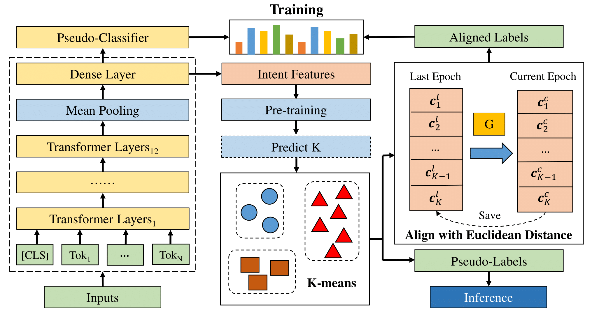

# Discovering New Intents with Deep Aligned Clustering

A deep aligned clustering method to discover new intents. 

## Introduction
This repository provides the PyTorch implementation of the research paper [Discovering New Intents with Deep Aligned Clustering](https://arxiv.org/pdf/2012.08987.pdf) (**Accepted by [AAAI2021](https://aaai.org/Conferences/AAAI-21/)**).

## Usage
<!--
Install all required library
```
pip install -r requirements.txt
```
-->
Get the pre-trained [BERT](https://storage.googleapis.com/bert_models/2018_10_18/uncased_L-12_H-768_A-12.zip) model and convert it into [Pytorch](https://huggingface.co/transformers/converting_tensorflow_models.html).

Run the experiments by: 
```
python DeepAligned.py --dataset clinc --fraction_of_clusters 1 --known_class_ratio 0.75
```
Selected Parameters
```
dataset: clinc | banking
factor_of_clusters: 1 (default) | 2 | 3 | 4 
known_class_ratio: 0.25 | 0.5 | 0.75 (default)
```
The model architecture of DeepAligned:



##  Results
### Main experiments
|   |       | CLINC |       |       |BANKING|       | 
|:--------:|:-----:|:-----:|:-----:|:-----:|:-----:|:-----:|
| Method   |  NMI  |  ARI  |  ACC  |  NMI  |  ARI  |  ACC  | 
| KM       | 70.89 | 26.86 | 45.06 | 54.57 | 12.18 | 29.55 | 
| AG       | 73.07 | 27.70 | 44.03 | 57.07 | 13.31 | 31.58 | 
| SAE-KM   | 73.13 | 29.95 | 46.75 | 63.79 | 22.85 | 38.92 | 
| DEC      | 74.83 | 27.46 | 46.89 | 67.78 | 27.21 | 41.29 | 
| DCN      | 75.66 | 31.15 | 49.29 | 67.54 | 26.81 | 41.99 | 
| DAC      | 78.40 | 40.49 | 55.94 | 47.35 | 14.24 | 27.41 | 
| DeepCluster  | 65.58 | 19.11 | 35.70 | 41.77 | 8.95  | 20.69 |
| PCK-means| 68.70 | 35.40 | 54.61 | 48.22 | 16.24 | 32.66 | 
| BERT-KCL | 86.82 | 58.79 | 68.86 | 75.21 | 46.72 | 60.15 | 
| BERT-MCL | 87.72 | 59.92 | 69.66 | 75.68 | 47.43 | 61.14 | 
| CDAC+ | 86.65 | 54.33 | 69.89 | 72.25 | 40.97 | 53.83 | 
| BERT-DTC | 90.54 | 65.02 | 74.15 | 76.55 | 44.70 | 56.51 | 
| DeepAligned   | __93.89__ | __79.75__ | __86.49__ | __79.56__ | __53.64__ | __64.90__ | 

### Ablation study
| Method   |       | CLINC |       |       |BANKING|       |   
|:--------:|:-----:|:-----:|:-----:|:-----:|:-----:|:-----:|
| Method   |  NMI  |  ARI  |  ACC  |  NMI  |  ARI  |  ACC  |
| w/o Pre + Reinit      | 57.80 | 9.63 | 23.02 | 34.34 | 4.49 | 13.67 | 
| w/o Pre + Align   | 62.53 | 14.10 | 28.63 | 36.91 | 5.23 | 15.42 | 
| Pre + Reinit      | 82.90 | 45.67 | 55.80 | 68.12 | 31.56 | 41.32 | 
| Pre + Align   | __93.89__ | __79.75__ | __86.49__ | __79.56__ | __53.64__ | __64.90__ | 

This work is to appear at the [Thirty-Fifth AAAI Conference on Artificial Intelligence](https://aaai.org/Conferences/AAAI-21/) (AAAI2021). An arXiv version for our paper is released [here](https://arxiv.org/pdf/2012.08987.pdf).

If you are instrested in this work, please **<star>** this repository and **<cite>** by. 
```
@article{zhang2020discovering,
      title={Discovering New Intents with Deep Aligned Clustering}, 
      author={Hanlei Zhang and Hua Xu and Ting-En Lin and Rui Lv},
      year={2020},
      journal={arXiv preprint arXiv:2012.08987},
}
```
### Acknowledgments
This paper is founded by National Natural Science Foundation of China, etc. 
